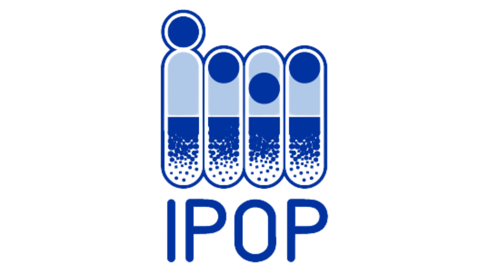

# University of Kentucky Institute for Pharmaceutical Outcomes & Policy

This GitHub organization exists to support UK-IPOP researchers by providing data anlaysis and data-driven software in an open format.

It is mostly maintained by Nick Anthony.
